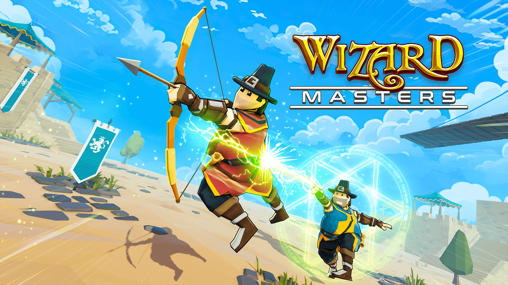

# Wizard Masters



## Overview

Wizard Masters is a multiplayer battle arena game where players control wizards with different elemental powers. Compete against other players in fast-paced magical combat, mastering spells and tactics to become the ultimate wizard.

## Project Structure

The project consists of two main components:
- **Client**: A ClojureScript frontend application using Shadow-CLJS and BabylonJS
- **Backend**: A Clojure server using Leiningen, Firebase, and Redis (optional)

## Prerequisites

Before running the project, ensure you have the following installed:

- [Node.js](https://nodejs.org/) and NPM
- [Leiningen](https://leiningen.org/) (required for running the backend)
- [Java Development Kit (JDK)](https://adoptium.net/) (version 17 or newer recommended)

## Installation and Setup

### Client Setup

1. Clone the repository
2. Install dependencies:
   ```
   npm install
   ```
3. Start the development server:
   ```
   npm run watch
   ```
   This will compile the ClojureScript code and start a development server.

### Backend Setup

1. Navigate to the backend directory:
   ```
   cd backend
   ```
2. **Firebase Configuration**:
   - Place your Firebase credentials (`firestore.json`) in the `resources/keys` folder
   - The file should contain your Firebase service account information

3. **Redis Configuration** (Optional):
   - Update the Redis URI in `backend/src/clj/enion_backend/redis.clj`
   - Look for the `my-conn-spec-1` definition and replace `[YOUR-REDIS-URI]` with your Redis URI

4. Start the backend server:
   ```
   lein run
   ```

## Connecting to Production Servers

If you don't want to run the backend locally, you can connect the client to production servers by modifying the network configuration:

1. Open `src/main/scene/network.cljs`
2. Update the `get-api-url` and `get-ws-url` functions:
   - Modify the conditions to always return the production URLs instead of the local development ones
   - For example, set `config/dev?` to `false` or directly return the production URL

## Development

- The client uses Shadow-CLJS for ClojureScript compilation
- The backend uses Leiningen for dependency management and running the server
- Both components have hot-reloading capabilities for rapid development

## License

© 2025 Wizard Masters. All rights reserved.
